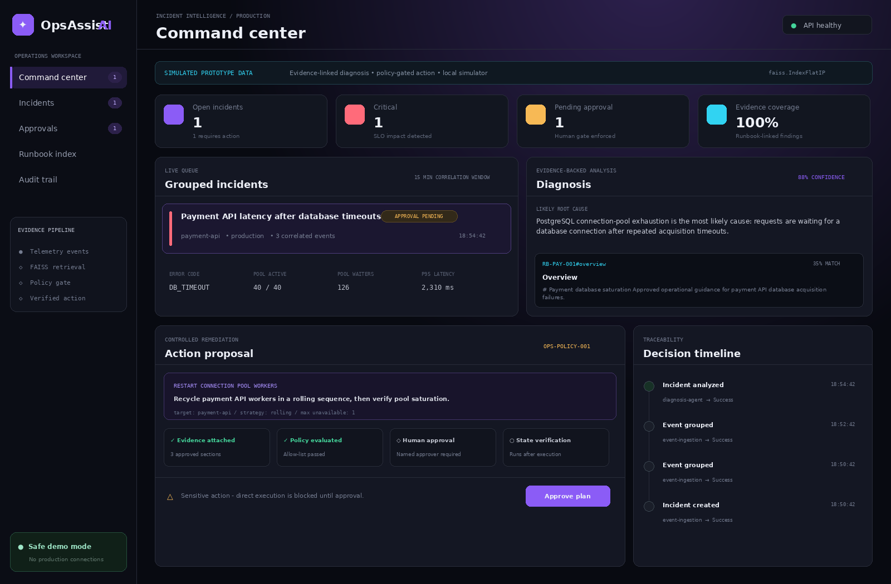
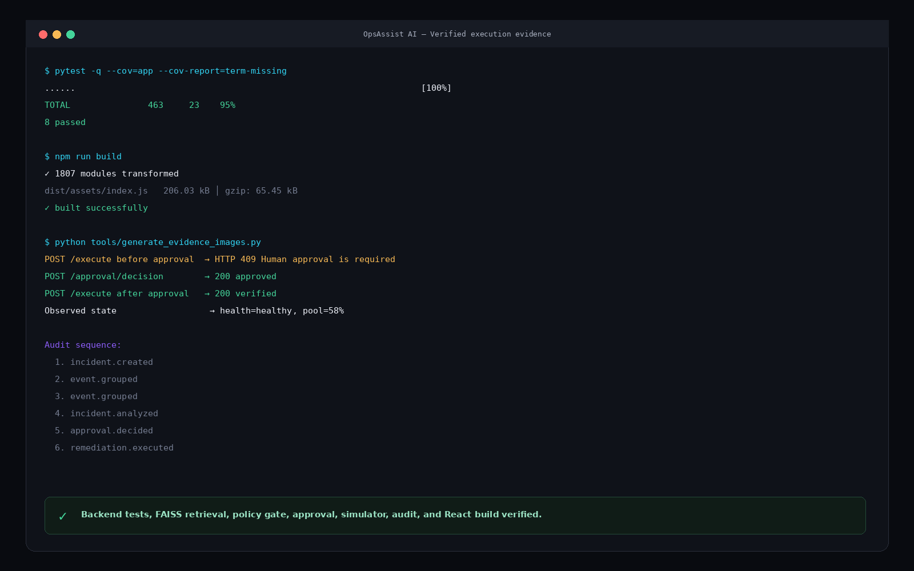
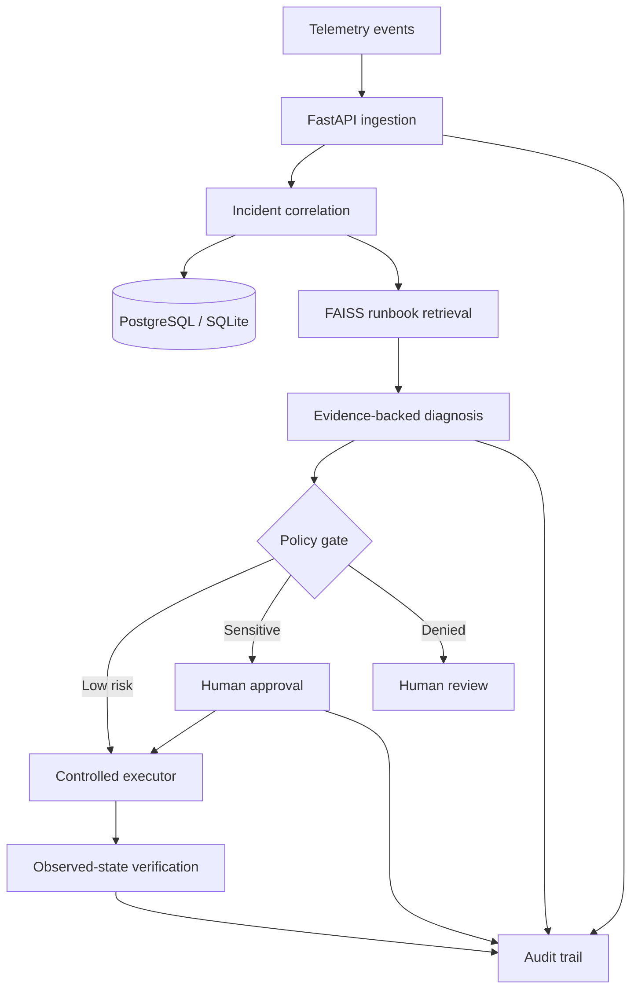

# OpsAssist AI

### Evidence-backed incident diagnosis and controlled remediation

[](https://github.com/aahanaahir22/opsassist-ai/actions/workflows/ci.yml)

## [Launch the public interactive demo →](https://opsassist-ai-demo.aahanaahir12.chatgpt.site)

The browser demo reproduces the safe incident workflow without requiring a local setup or production credentials: inspect FAISS evidence, approve the proposed action, execute the controlled simulator, verify observed recovery metrics, and review the resulting audit trail.

OpsAssist AI turns fragmented operational signals into a traceable incident decision. It groups related telemetry, retrieves approved runbook evidence with FAISS, produces a typed diagnosis and action plan, enforces a human approval gate for sensitive actions, simulates least-privilege execution, verifies observed state, and records the full audit trail.

> **Portfolio prototype:** all included incidents, metrics, identities, systems, and execution results are simulated. The executor never connects to production infrastructure.





## Why this project exists

Incident response is often slowed by logs, alerts, runbooks, and remediation decisions living in separate tools. Generic AI advice adds another risk when it cannot show evidence or control execution. OpsAssist AI demonstrates a safer alternative: recommendations are linked to versionable runbook sections, validated against an allow-list and confidence threshold, and blocked until the appropriate approval exists.

## What the working demo proves

- REST event ingestion with a 15-minute correlation window
- Incident grouping by environment, service, and error code
- Local TF-IDF embeddings searched through `faiss.IndexFlatIP`
- Stable evidence IDs such as `RB-PAY-001#connection-pool-exhaustion`
- Pydantic-validated action plans with target, risk, parameters, and evidence IDs
- Explicit allow-list, confidence threshold, and sensitive-action policy
- Named human approval before state-changing remediation
- Least-privilege simulated executor with before/after state verification
- Queryable audit history for grouping, diagnosis, approval, and execution
- React + TypeScript command center connected to live FastAPI endpoints
- SQLite zero-setup mode and PostgreSQL Docker mode
- Automated backend tests and a frontend production build in GitHub Actions

## Architecture



The detailed component responsibilities and trust boundaries are in [docs/architecture.md](docs/architecture.md).

## Repository map

```text
opsassist-ai/
├── .github/workflows/ci.yml       # backend tests + frontend build
├── backend/
│   ├── app/
│   │   ├── data/runbooks/         # approved retrieval evidence
│   │   ├── config.py              # environment-based settings
│   │   ├── database.py            # SQLAlchemy engine/session
│   │   ├── engine.py              # correlation, FAISS, diagnosis, policy, execution
│   │   ├── main.py                # FastAPI routes and lifecycle
│   │   ├── models.py              # incident/event/approval/audit entities
│   │   ├── schemas.py             # typed API and action-plan contracts
│   │   └── seed.py                # reproducible payment-timeout scenario
│   ├── tests/                     # integration tests for the safety workflow
│   ├── Dockerfile
│   └── requirements.txt
├── frontend/
│   ├── src/main.tsx               # connected React command center
│   ├── src/styles.css             # responsive visual system
│   ├── Dockerfile
│   ├── nginx.conf                 # SPA serving + API proxy
│   └── package.json
├── docs/                          # architecture, API, demo, decisions
├── screenshots/                   # recruiter-verifiable execution evidence
├── .env.example
├── docker-compose.yml
├── Makefile
└── README.md
```

## Quick start - Docker

Prerequisites: Docker Desktop with Docker Compose.

```bash
git clone https://github.com/aahanaahir22/opsassist-ai.git
cd opsassist-ai
cp .env.example .env
docker compose up --build
```

Open:

- Dashboard: `http://localhost:8080`
- Interactive API docs: `http://localhost:8000/docs`
- Health endpoint: `http://localhost:8000/health`

Docker runs PostgreSQL, FastAPI, and the production React build. The demo incident is seeded automatically on the first start.

## Quick start - local development

Prerequisites: Python 3.12+, Node.js 22+, and Git.

```bash
git clone https://github.com/aahanaahir22/opsassist-ai.git
cd opsassist-ai
python -m venv .venv
source .venv/bin/activate            # Windows: .venv\Scripts\activate
pip install -r backend/requirements-dev.txt
cd frontend && npm install && cd ..
```

Terminal 1:

```bash
source .venv/bin/activate
cd backend
uvicorn app.main:app --reload --port 8000
```

Terminal 2:

```bash
cd frontend
npm run dev
```

Open `http://localhost:5173`. SQLite is used automatically; PostgreSQL is not required for this route.

## Reproduce the safety workflow

Reset the deterministic incident:

```bash
curl -X POST http://localhost:8000/api/v1/demo/reset
```

The scenario groups three `DB_TIMEOUT` events for `payment-api`, retrieves payment database runbook evidence, proposes a rolling worker recycle at 0.88 confidence, and creates a pending approval.

Trying to execute before approval returns HTTP `409`:

```bash
curl -X POST http://localhost:8000/api/v1/incidents/INCIDENT_ID/execute
```

Approve using the ID from `GET /api/v1/approvals`:

```bash
curl -X POST http://localhost:8000/api/v1/approvals/APPROVAL_ID/decision \
  -H "Content-Type: application/json" \
  -d '{
    "decision": "approved",
    "decided_by": "on-call.engineer@example.com",
    "reason": "Evidence and rolling safeguards verified."
  }'
```

Then execute and inspect `GET /api/v1/audit?incident_id=INCIDENT_ID`. The executor returns a simulated verified state; it does not call Kubernetes, AWS, or any production target.

## API surface

| Method | Route | Purpose |
| --- | --- | --- |
| `GET` | `/health` | Readiness and execution-mode disclosure |
| `POST` | `/api/v1/events` | Ingest one normalized telemetry event |
| `GET` | `/api/v1/incidents` | List grouped incidents |
| `GET` | `/api/v1/incidents/{id}` | Incident, evidence, action, and events |
| `POST` | `/api/v1/incidents/{id}/analyze` | Re-run retrieval, diagnosis, and policy |
| `GET` | `/api/v1/approvals` | List approval requests |
| `POST` | `/api/v1/approvals/{id}/decision` | Approve or reject with identity and reason |
| `POST` | `/api/v1/incidents/{id}/execute` | Run the policy-checked simulator |
| `GET` | `/api/v1/audit` | Query traceable decisions |
| `POST` | `/api/v1/demo/reset` | Restore the deterministic demo |

See [docs/api.md](docs/api.md) for contracts and example payloads.

## Validation

```bash
cd backend
ruff check app tests
pytest -q --cov=app --cov-report=term-missing

cd ../frontend
npm run build
```

The repository includes integration coverage for grouping, evidence attachment, pre-approval blocking, approval, execution verification, audit completeness, and dashboard metrics. CI fails if backend coverage drops below 85% or the TypeScript production build fails.

## Security choices

- No real infrastructure SDK or shell executor is included.
- Sensitive actions require a stored, named approval.
- Unknown actions and low-confidence diagnoses are denied.
- Runbook excerpts carry stable evidence identifiers.
- Optional `X-API-Key` protection is enabled by setting `OPSASSIST_API_KEY`.
- Environment variables are excluded from Git; `.env.example` contains no secret.
- This prototype audit table is traceable but not legally immutable. A production design should use append-only storage and external integrity controls.

Read [SECURITY.md](SECURITY.md) before extending the executor.

## Evaluation framework

The repository deliberately avoids invented production results. A fair evaluation should measure:

| Dimension | Definition |
| --- | --- |
| Retrieval precision@k | Relevant runbook chunks among the top-k evidence results |
| Evidence coverage | Diagnoses carrying at least one approved evidence ID |
| Diagnostic accuracy | Root-cause label accuracy on a reviewed scenario set |
| Policy compliance | Sensitive actions blocked until a valid approval exists |
| API latency | p50/p95 time for ingestion, analysis, and audit reads |
| End-to-end response | Event arrival to verified simulated outcome |

## Engineering decisions

- **Deterministic local diagnosis:** the demo is reproducible and needs no paid key. An LLM adapter can later be added behind the same typed plan contract.
- **FAISS with TF-IDF vectors:** small, inspectable, CPU-only retrieval demonstrates the indexing path without a model download.
- **SQLite plus PostgreSQL:** reviewers get a zero-setup path while Docker demonstrates a production-style relational dependency.
- **Simulation by design:** the project demonstrates control-plane reasoning without creating an unsafe autonomous operations tool.

## Roadmap

- OpenTelemetry ingestion adapter and schema validation
- PostgreSQL migrations with Alembic
- Optional local/hosted LLM diagnosis adapter with structured outputs
- Role-based approval scopes and expiring approvals
- Append-only audit sink with hash chaining
- Scenario benchmark for retrieval and diagnostic evaluation
- AWS ECS deployment and CloudWatch telemetry in a sandbox account

## Author

**Aahana Ahir** - B.Tech Computer Science and Engineering, VIT Bhopal University (2027)

[LinkedIn](https://www.linkedin.com/in/aahanaahir02/) · [Email](mailto:aahanaahir10@gmail.com)
