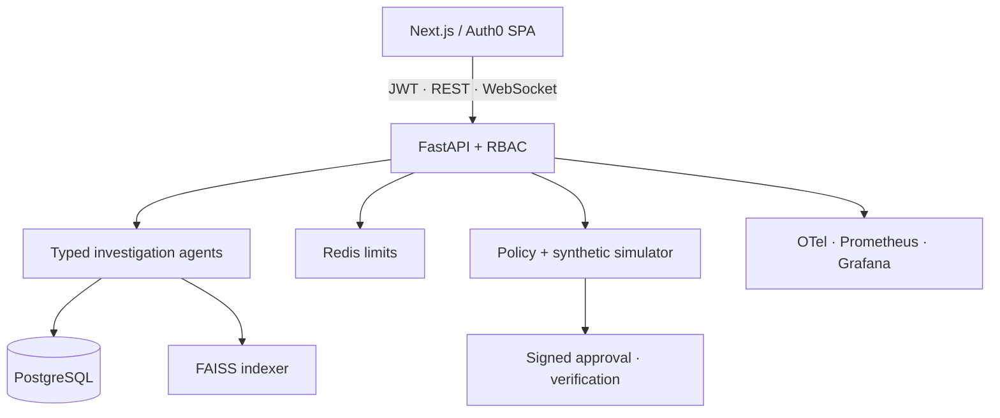
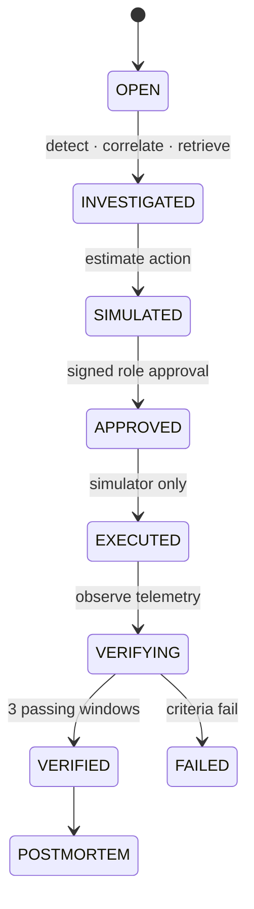

# OpsAssist AI

OpsAssist AI is an evidence-backed incident-investigation portfolio system. Its public interface visualizes a synthetic service universe, while a modular Python service performs numerical anomaly detection, event correlation, cited retrieval, typed agent orchestration, transparent root-cause scoring, counterfactual simulation, policy-gated execution, telemetry verification, and postmortem generation.

**Public demo:** https://opsassist-ai.aahanaahir12.chatgpt.site

> All public-demo infrastructure and telemetry are synthetic. Actions run only in the deterministic simulator. Recovery probabilities are estimates. This is a portfolio prototype, not a production incident-management product.

## Thirty-second tour

Launch the Checkout scenario, investigate it, open the evidence behind the leading hypothesis, compare score components, simulate a rollback, sign the required approval, execute only in the simulator, wait for three recovery windows, and export a cited postmortem. With no Python URL configured, the hosted UI remains available in clearly labelled offline-demo mode.

## What is real

- FastAPI, Pydantic v2, SQLAlchemy 2, Alembic, PostgreSQL with SQLite fallback, structured logs, OpenAPI and WebSockets.
- Rolling Z-score, Isolation Forest, change-point and rate-of-change detectors with deterministic tests.
- TF-IDF features plus DBSCAN, temporal/trace/service/dependency evidence and secret redaction for correlation.
- Versioned chunks with exact citations, metadata/trust filters and injection detection. A dedicated Sentence Transformer + FAISS service atomically promotes persistent index versions; transparent TF-IDF remains the local no-download fallback.
- Eleven independently invoked, schema-constrained OpenAI agents coordinated by an async state machine, with evidence-ID validation and typed partial fallback. Offline mode remains deterministic and reproducible.
- Auth0 Universal Login and Organizations, RS256/JWKS token verification, endpoint permissions and database-enforced tenant filters. The public portfolio profile stays explicitly unauthenticated; the production profile fails closed when Auth0 is incomplete.
- Configurable weighted root-cause ranking with contradiction penalties.
- Deterministic graph-based estimates for rollback, restart, scaling, pool-size and integration-disable actions.
- Backend policy enforcement, signed approvals, role checks, idempotent execution, immutable-style audit events and verification gates.
- Five versioned scenario datasets and generated evaluation artifacts.

## Architecture



The frontend remains at repository root because moving it would break the existing Sites deployment contract. The Python application lives under `apps/api`.

## Incident lifecycle



## Repository shape

```text
app/                       existing visual frontend
lib/                       typed browser API client
apps/api/app/              FastAPI, schemas, database and services
apps/api/migrations/       Alembic migration
apps/api/tests/            backend and workflow tests
apps/indexer/              persistent Sentence Transformer + FAISS service
apps/backup/               PostgreSQL backup runner
ai/                        package boundaries for AI/ML extensions
simulator/                 package boundaries for twin extensions
data/scenarios/            five reproducible incident datasets
data/runbooks/             versioned knowledge documents
data/evaluation/           queries and generated results
scripts/                   index, seed and evaluation commands
docs/                      architecture, API, RAG, safety and demo docs
infra/                     OTel Collector, Prometheus alerts and Grafana dashboard
.github/workflows/ci.yml   Python, frontend, containers and secret scan
```

## Local setup

### Docker

```bash
cp .env.example .env
docker compose up --build
```

The UI is available at `http://localhost:3000`; API docs are at `http://localhost:8000/docs`.

### Without Docker

```bash
python3.12 -m venv .venv
source .venv/bin/activate
pip install -e 'apps/api[dev]'
export PYTHONPATH="$PWD/apps/api"
export OPSASSIST_DATA_DIR="$PWD/data"
uvicorn app.main:app --app-dir apps/api --reload
```

In a second terminal:

```bash
npm ci
NEXT_PUBLIC_API_BASE_URL=http://localhost:8000/api/v1 \
NEXT_PUBLIC_WS_URL=ws://localhost:8000/api/v1/events npm run dev
```

## Reproducible commands

```bash
python scripts/build_index.py
python scripts/evaluate_retrieval.py
python scripts/seed_demo.py
python scripts/evaluate_all.py
pytest apps/api/tests -q
npm run lint
npx tsc --noEmit
npm test
```

For semantic embeddings and FAISS:

```bash
OPSASSIST_EMBEDDING_BACKEND=sentence_transformer python scripts/build_index.py
```

The default local TF-IDF index avoids a model download. The production Compose/Railway indexer uses `sentence-transformers/all-MiniLM-L6-v2`, writes a versioned FAISS artifact, validates its manifest and promotes it atomically through `current.json`. Generated indexes, databases and model caches are intentionally ignored; rebuild them from source.

## Production profile

The production-like topology is API + PostgreSQL + Redis + semantic indexer, with optional OTel Collector, Prometheus and Grafana services. Configure Auth0 Organizations and the OpenAI key as deployment secrets, then set:

```bash
OPSASSIST_ENVIRONMENT=production
OPSASSIST_AUTO_CREATE_SCHEMA=false
OPSASSIST_AUTH_REQUIRED=true
OPSASSIST_AI_MODE=openai
```

Alembic must succeed before Uvicorn starts. Railway currently enforces this as a single-replica container startup gate because its pre-deploy phase could not reach the private database; larger deployments should move the same command to a serialized release job. See [docs/authentication.md](docs/authentication.md) and [docs/production-operations.md](docs/production-operations.md).

## API example

```bash
curl -s http://localhost:8000/api/v1/incidents/simulate \
  -H 'content-type: application/json' \
  -d '{"scenario_id":"checkout_pool_exhaustion","seed":847}'
```

Connect to `ws://localhost:8000/api/v1/events?incident_id=inc_...` for events such as `agent.started`, `evidence.created`, `hypothesis.updated`, `simulation.completed`, `approval.recorded`, and `incident.recovered`.

## Methods and evaluation

Root-cause scores are a normalized weighted sum of temporal precedence, anomaly severity, dependency centrality, trace relationships, deployment proximity, historical similarity, runbook relevance and agent agreement, multiplied by a contradiction penalty. The UI can display the returned components directly.

Evaluation scripts compute anomaly precision/recall/F1 and retrieval Precision@K, Recall@K and MRR from checked-in files. The current compact benchmark is intentionally small; scores demonstrate reproducibility, not production validity. See [docs/evaluation.md](docs/evaluation.md).

## Safety and limitations

- No production infrastructure connector exists.
- Remediation always targets the checked-in synthetic simulator. Auth0, PostgreSQL, Redis, OpenAI and telemetry integrations do not add a connector to customer infrastructure.
- The datasets are compact and synthetic; evaluation numbers do not predict real-world SRE performance.
- The agent state machine returns evidence summaries, not hidden chain-of-thought.
- OpenAI mode requires an operator-supplied secret and emits schema-validated findings with exact evidence references. It falls back to a labelled partial offline result on provider failure.
- Simulation is deterministic counterfactual estimation, not a production guarantee.

See [docs/safety.md](docs/safety.md), [SECURITY.md](SECURITY.md), and [CONTRIBUTING.md](CONTRIBUTING.md).
